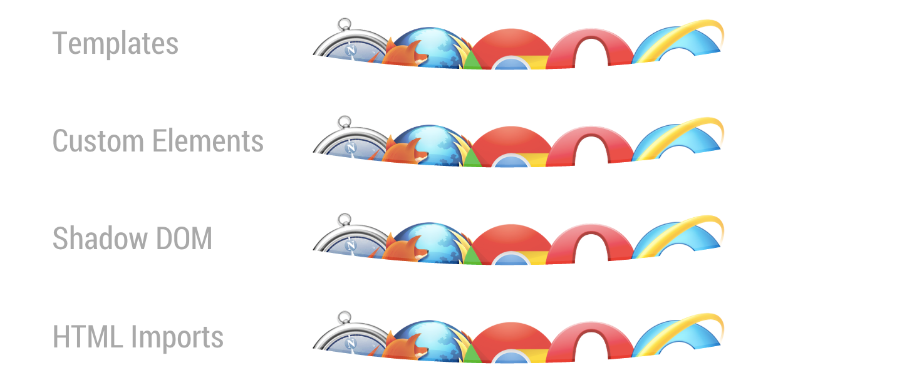

# Web Components<br>and Polymer

### GDG Oslo DevFest 2014

---

## [Thomas](https://twitter.com/tbassetto)

### Software Engineer at [Soundrop](https://twitter.com/soundrop)

---

## Who is mostly doing (front-end) web development?

---

# Agenda

1. Web Components
1. Polymer
1. Other Web Components implementations
1. Integration with frameworks
1. Who is using them today?

---

# Web Components


---

# Web Components

Web Components give web developers the primitives necessary to buid their own components.

Why are tabs so hard? Why is `<select>` in the spec but not `<tabs>` or `<pages>`?

---

# Web Components

- [<template>](http://www.w3.org/TR/html5/scripting-1.html#the-template-element)
- [Custom Elements](http://www.w3.org/TR/custom-elements/)
- [Shadow DOM](http://www.w3.org/TR/shadow-dom/)
- [HTML Imports](http://www.w3.org/TR/html-imports/)

---

# <template>

---

# <template>

```html
<script type="text/template" id="user-profile">
	<div class="user" style="…">
		<span class="name">{{user}}</span>
		
	</div>
</script>
```

1. The content is a `string`
2. Fragile (no `<script>` in your template)

---

# <template>

```html
<template id="user-profile">
	<div class="user" style="…">
		<span class="name"></span>
		
	</div>
</template>
```

---

# Custom Elements


---

# Custom Elements

1. Define new HTML/DOM elements.
1. Bundle together custom functionality into a single tag.
1. Create elements that extend from other elements.
1. Extend the API of existing DOM elements.

---

# Custom Elements

```javascript
var XFoo = document.registerElement('x-foo', {
	// default
	prototype: Object.create(HTMLElement.prototype)
});
document.body.appendChild(new XFoo());
```

The name **must contain a dash (-)**.

`<x-foo>` and `<my-awesome-app>` are all valid names, while `<tabs>` and `<foo_bar>` are not.

---

# Custom Elements

```javascript
var MegaButton = document.registerElement('mega-button', {
	prototype: Object.create(HTMLButtonElement.prototype),
	extends: 'button'
});
```

```html
<button is="mega-button"></button>
```

---

# Custom Elements

```javascript
var XFoo = document.registerElement('x-foo', {
	prototype: Object.create(HTMLElement.prototype, {
		bar: {
			get: function() { return 5; }
		},
		foo: {
			value: function() {
				alert('foo() called');
			}
		}
	})
});
```

---

# Shadow DOM

---

# Shadow DOM


---

# Shadow DOM

```javascript
var myElement = document.createElement('div');
var root = myElement.createShadowRoot();
root.appendChild(someTemplateContent);
```

---

# HTML Imports

---

# HTML Imports

- CSS has `<link rel="stylesheet" href="app.css">`
- JavaScript has `<script src="app.js"></script>`
- Images have ``
- …

The majority of the web's content has a simple and declarative way to load itself.

---

# HTML Imports

HTML has… `<iframe>`, `AJAX` and `<script type="text/template"/>`…

---

# HTML Imports

index.html:

```html
<link rel="import" href="bootstrap.html">
```

bootstrap.html:

```html
<link rel="stylesheet" href="bootstrap.css">
<link rel="stylesheet" href="bootstrap-theme.css">
<script src="jquery.js"></script>
<script src="bootstrap.js"></script>
<template>...</template>
```

---

# HTML Imports

Importers can grab a specific portion of this document and clone it into their page:

```html
<head>
	<link rel="import" href="warnings.html">
</head>
<body>
	<script>
		var link = document.querySelector('link[rel="import"]');
		var content = link.import;
		var el = content.querySelector('.warning');
		document.body.appendChild(el.cloneNode(true));
	</script>
</body>
```

---

# Vulcanize

`npm install -g vulcanize`

`$ vulcanize -o  build.html index.html \`
`    --csp  --strip`

---


# grunt-vulcanize

---


# gulp-vulcanize

---

# customelements.io


---

# Browser Support

---


---

# Polymer


---

# The Polymer Project

- *Fix modern browsers* with `webcomponents.js` (previously called `platform.js`)
- Add "syntactic sugar" with `polymer.js`
- Provide basic/material sets of components

---



---

# Sugaring: Custom Elements

```javascript
document.registerElement('user-profile', {
	prototype: Object.create(HTMLElement.prototype)
});
```

```html
<polymer-element name="user-profile">
	…
</polymer-element>
```

---

# Sugaring: Custom Elements

```javascript
document.registerElement('mega-button', {
	prototype: Object.create(HTMLButtonElement.prototype),
	extends: 'button'
});
```

```html
<polymer-element name="mega-button" extends="button">
	…
</polymer-element>
```

---

# Sugaring: Templates

```html
<polymer-element name="user-list" noscript>
	<template>
		<ul>
			<template repeat="{{user, i in users}}">
				<li>{{user.name}}</li>
			</template>
		</ul>
	</template>
</polymer-element>
```

---

# The Core and Paper elements

---

# core-*

A set of utility elements including general-purpose UI elements (such as icons, layout elements, and toolbars), as well as non-UI elements providing features like AJAX, signaling and storage.

- `core-collapse`
- `core-tooltip`
- `core-image`
- `core-ajax`
- …

---

# paper-*

The Paper elements are a set of UI elements that implement the material design system.

- `paper-button`
- `paper-checkbox`
- `paper-toggle-button`
- …

---

# Other Web Components implementations

---

# X-Tag + Brick


- [X-Tag](http://x-tags.org) is a small JavaScript library, created and supported by Mozilla, that brings Custom Element and HTML Imports capabilities to all modern browsers (**IE9+**).
- [Brick](https://mozbrick.github.io/) is a collection of UI components designed for the easy and quick building of web application UIs.
- [Polymer, X-Tag/Brick and vanilla custom elements](https://www.polymer-project.org/articles/polymer-xtag-vanilla.html)
- [What's next for X-Tag project](http://webcomponents.org/articles/interview-with-daniel-buchner/)

---

# Bosonic


[Bosonic](https://bosonic.github.io/index.html) uses some Polymer polyfills (Custom Elements, Mutation Observers and Weak Maps) and brings its own polyfills including a powerful yet simple one for Shadow DOM.

---

# Integration with frameworks

---

# ReactJS

- [react-element](https://github.com/Versal/react-element): register your react component as custom element
- [ReactiveElements](https://github.com/PixelsCommander/ReactiveElements): allows to use React.js component as HTML element
- [Combining React, Flux & Web Components](http://futurice.com/blog/combining-react-flux-and-web-components): I hope this helped clarify how […] Flux and Web Components are fundamentally different, and yet still composable in interesting ways.

---

# EmberJS

- [Introduction to EmberJS](http://emberjs.com/guides/components/): Once Custom Elements are widely available in browsers, you should be able to easily migrate your Ember components to the W3C standard and have them be usable by other frameworks.
- [Ember and Web Components](https://gist.github.com/wycats/9144666b0c606d1838be): We are choosing a different transitional strategy that differs from Polymer's strategy, because our medium-term requirements are different, but our long-term goals are aligned.

---

# AngularJS 1.x

- [Integrating Web Components with AngularJS](https://pascalprecht.github.io/2014/10/25/integrating-web-components-with-angularjs/): Everything is DOM. Angular doesn't know and shouldn't know about custom elements.

---

# AngularJS 2.x

- [Integrating Web Components with AngularJS](https://pascalprecht.github.io/2014/10/25/integrating-web-components-with-angularjs/): Everything is DOM. Angular doesn't know and shouldn't know about custom elements.
- [Polymer Notes](https://docs.google.com/document/d/16O2Im1ekfdJ4FU8FBbVRYGjqsXjmcV3tYFg1vyfhYC8/edit#): While it is unlikely that Angular 2.0 can simply be built as a layer on top of Polymer, it is likely that use can be made out of the polyfills and that much can be learned from some of the positives and negatives of their implementations.

---

# Who is using Web Components today?

---

# Great Standalone Components

- [time-elements](https://github.com/github/time-elements)
- [select-element](https://ebidel.github.io/polymer-experiments/select-element/)
- [GoogleWebComponents](http://googlewebcomponents.github.io)
- [voice-elements](http://zenorocha.github.io/voice-elements/)

---

# "Full" Websites

---

# [Poly-Mail](https://poly-mail.appspot.com/)


---

# [Topeka](https://www.polymer-project.org/apps/topeka/)


---

# [Santa Tracker](https://santatracker.google.com/#village)


---

# Conclusion

Yay for more interoperability between components!

As long as they are **F**ocused, **I**ndependent, **R**eusable, **S**mall & **T**estable (**FIRST**).

---

# Questions
